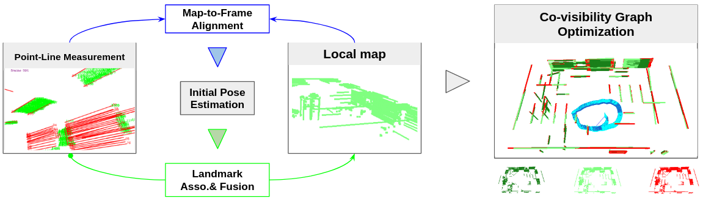
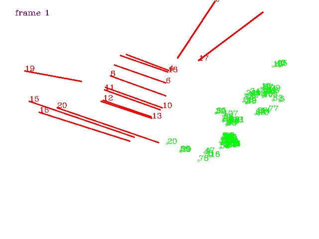
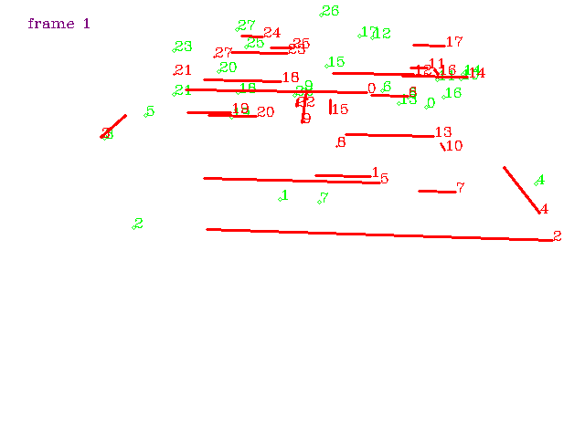
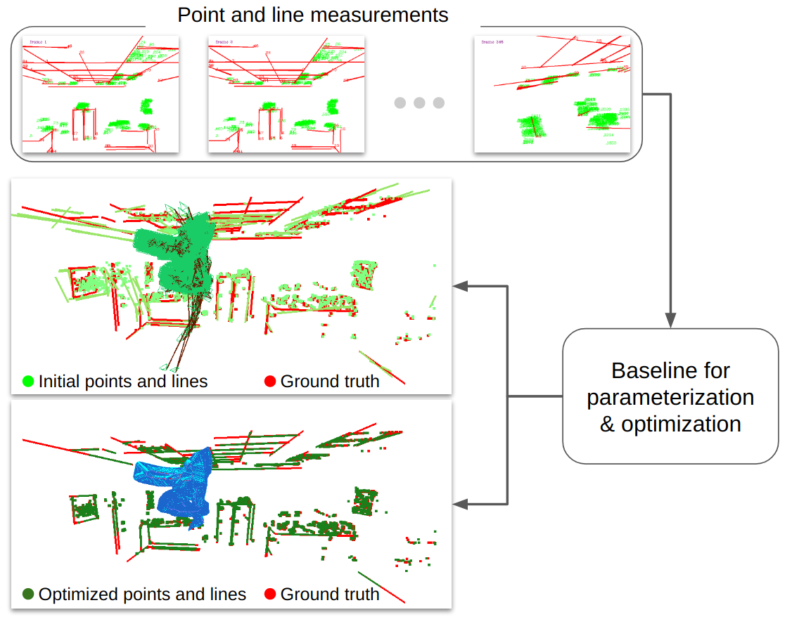

# Open-Structure: a Structural Benchmark Dataset for SLAM Algorithms

  

  <!--  -->
  
  

 

This new benchmark dataset, Open-Structure, is proposed for evaluating visual odometry and SLAM methods, which directly equips point and line measurements, correspondences, structural associations, and co-visibility factor graphs instead of providing raw images. Based on the proposed benchmark dataset, these 2D or 3D data can be directly input to different stages of SLAM pipelines to avoid the impact of the data preprocessing modules in ablation experiments.

#### 1. Asset of Open-Structure Dataset

|                          2D images                           |                        Download Link                         |
| :----------------------------------------------------------: | :----------------------------------------------------------: |
|  | living room 0   living room 1   living room 2   living room 2 |
|  | office room 0   office room 1   office room 2   office room 2 |
|  | carwelding   cmu-office2   endofworld  hospital   japanesealley  neighborhood |
|  | struct_texture_far   struct_texture_near   nostruct_texture_near_withloop   nostruct_texture_far   struct_notexture_near  struct_notexture_far |
|  | Circle1   Circle2   Sphere1   Sphere2   Corridor1  Corridor2 |

#### 2. Baseline for Optimization

  <!--  -->
  
  

