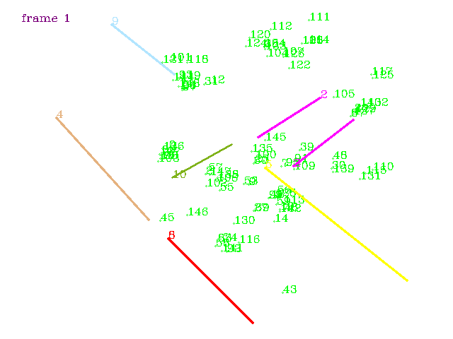
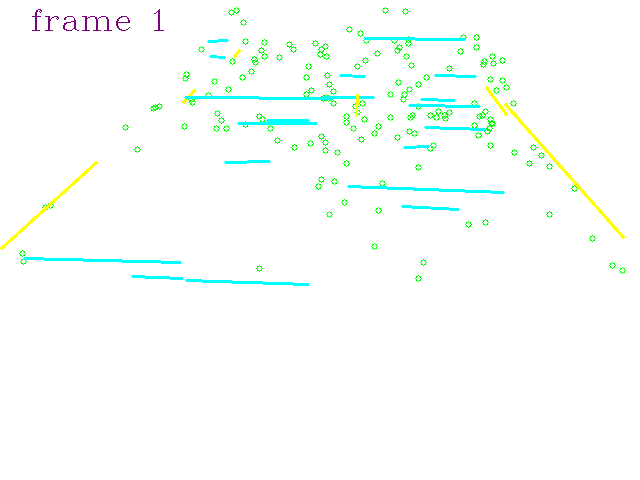
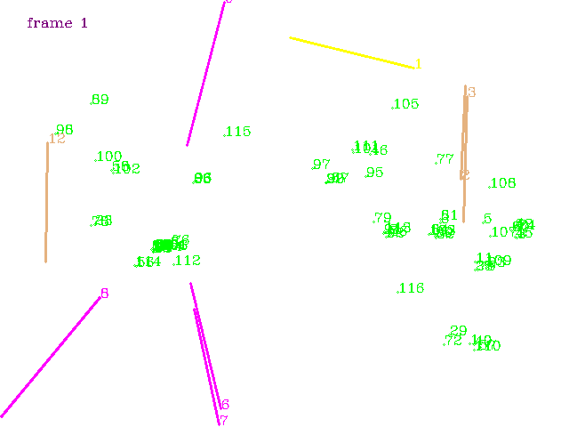
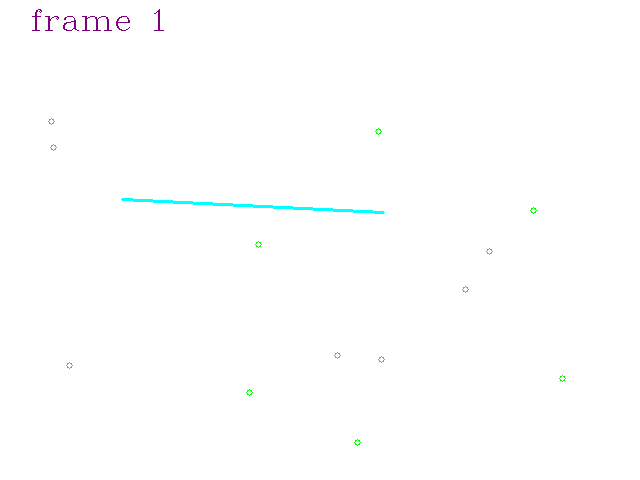
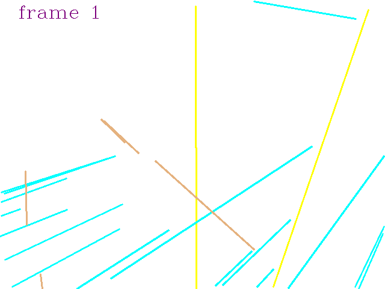
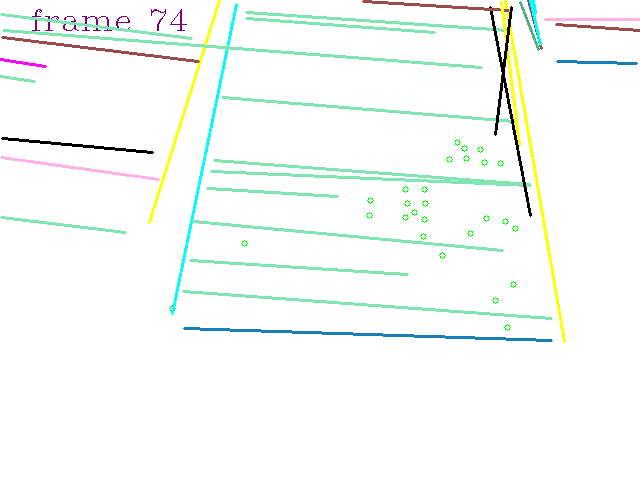
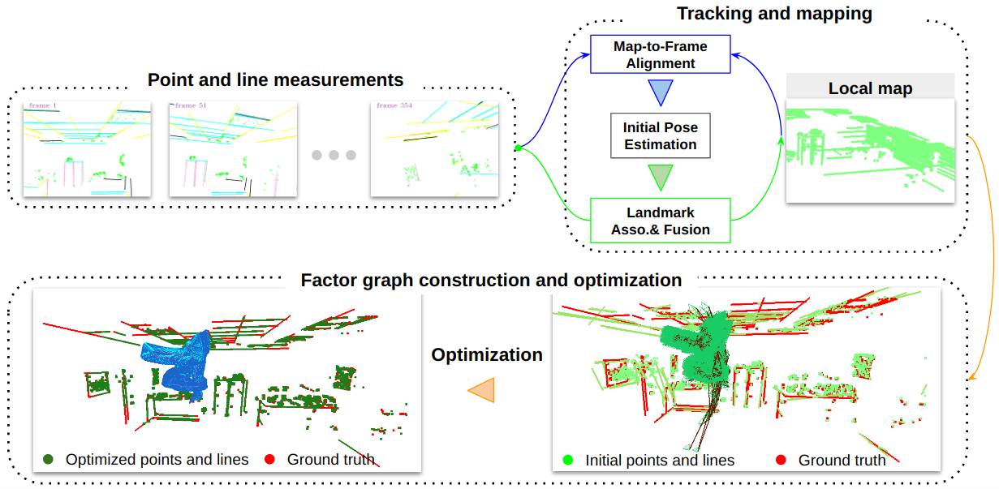

# Open-Structure: a Structural Benchmark Dataset for SLAM Algorithms

### Abstract

*This paper introduces a new benchmark dataset, Open-Structure, for evaluating visual odometry and SLAM methods, which directly equips point and line measurements, correspondences, structural associations, and co-visibility factor graphs instead of providing raw images. Based on the proposed benchmark dataset, these 2D or 3D data can be directly input to different stages of SLAM pipelines to avoid the impact of the data preprocessing modules in ablation experiments. First, we propose a dataset generator for real-world and simulated scenarios. In real-world scenes, it maintains the same observations and occlusions as actual feature extraction results. Those generated simulation sequences enhance the dataset's diversity by introducing various carefully designed trajectories and observations. Second, a SLAM baseline is proposed using our dataset to evaluate widely used modules in camera pose tracking, parametrization, and optimization modules. By evaluating these state-of-the-art algorithms across different scenarios, we discern each module's strengths and weaknesses within the camera tracking and optimization process.*

<p align="center">
     <a href="coming soon"></a>
  <a href="https://github.com/yanyan-li/Open-Structure/tree/feature/yanyan/dataset"></a>
    <a href="https://github.com/yanyan-li/Open-Structure/tree/feature/yanyan/baseline"></a>
</p>

#### 1. Dataset of Open-Structure

|                  |  |  |
| ------------------------------------------------------ | ------------------------------------------------------------ | ------------------------------------------------------------ |
|  |              |     |
|  |    |      |


#### 2. Baseline of Open-Structure


#### 3. BibTeX

```
@inproceedings{liopenstructure,
  author = {Li, Yanyan and Guo, Zhao and Yang, Ze and Sun Yanbiao and Liang, Zhao and Tombari, Federico},
  title = {Open-Structure: a Structural Benchmark Dataset for SLAM Algorithms},
  year = {2023},
  booktitle = {arXiv}
 }
```

