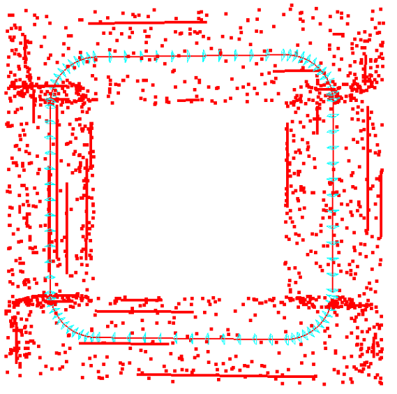
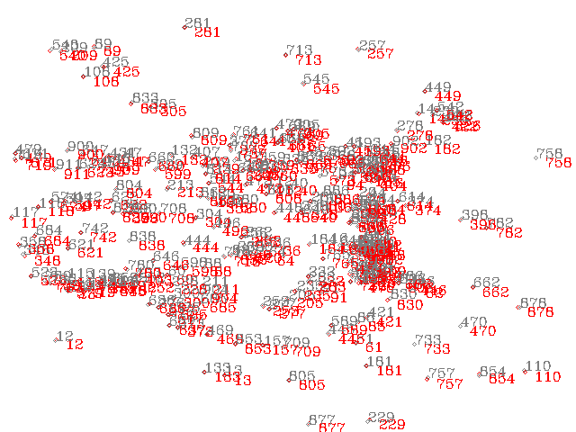
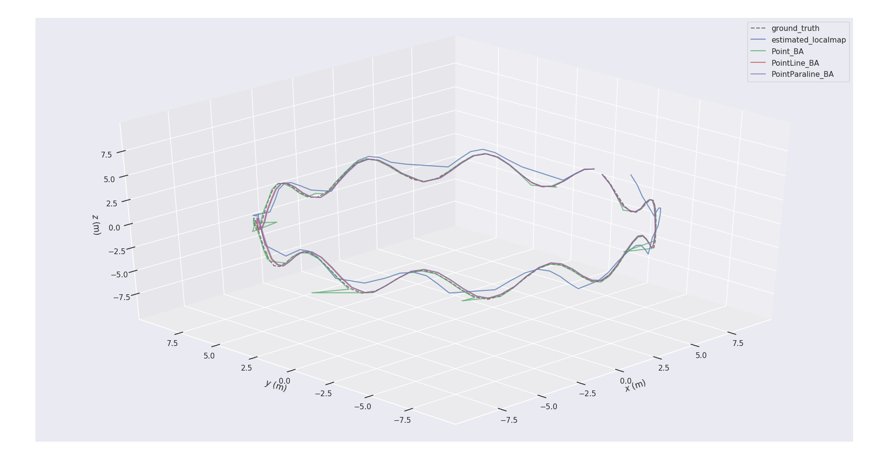

# Baseline of Open-Structure Benchmark 


## 1. License

JCE-SLAM Simulator is released under [GNU General Public License v3.0](LICENSE). The closed-source version of JCE-SLAM used in SLAM systems for commercial purposes, please contact yanyan.li.camp@gmail.com. If you use this work in your academic work, please cite:
```

```


## 2. Prerequisites 

We have tested the library in **Ubuntu 18.04**, but it should be easy to compile in other platforms.

#### 2.1 Your local environment

#### C++11 or C++0x Compiler

We use the new thread and chrono functionalities of C++11.

#### Pangolin

We use [Pangolin](https://github.com/stevenlovegrove/Pangolin) for visualization and user interface. Dowload and install instructions can be found at: https://github.com/stevenlovegrove/Pangolin.

#### OpenCV

We use [OpenCV](http://opencv.org/) to manipulate images and features. Dowload and install instructions can be found at: [http://opencv.org](http://opencv.org/). **Required at leat 3.0. Tested with OpenCV 3.2.0 and 4.4.0**.

#### Eigen3

Required by g2o (see below). Download and install instructions can be found at: [http://eigen.tuxfamily.org](http://eigen.tuxfamily.org/). **Required at least 3.1.0**.

#### 2.2 Prepared Docker Image 

Clone the repo, and it is easy to build your own image and container based on the dockerfile proposed in the **Docker** folder. The proposed [docker environment](docker/readme.md) contains the following  libs: Pangolin, OpenCV, Eigen and minor supported libraries.   

**Choices for optimization:**

*Popular optimization libraries including ceres, gtsam and g2o can be selected here based on your particular preferences.* 
Optimization libraries are not installed in advance, but suggestions for installing can be found  [here](thirdparty/readme.md).

## 3. Building Baseline Simulator

Clone the repository:
```
git clone https://github.com/yanyan-li/JFG-SLAM.git  
cd JFG-SLAM/build
cmake ..
make
```

## 4. Examples

#### 4.1 Simulation Dataset

```
cd evaluation/Corridor
evo_traj tum Point_BA.txt PointLine_BA.txt PointParaline_BA.txt PointParaline_JFG_BA.txt  --ref=ground_truth.txt  -p --plot_mode=xyz

```
|  corridor scene and trajectory   |      2D measurements of every frame      |      |
| :---:| :----: | :----: |
|  |  |  |


