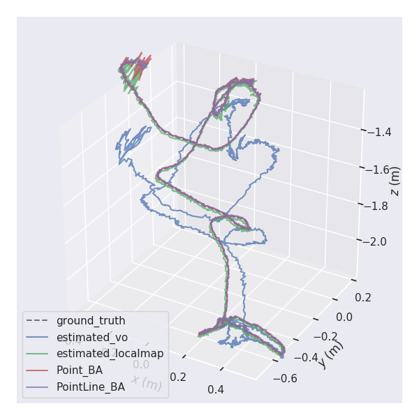

## Baseline of Open-Structure Benchmark Dataset


### 1. License

This SLAM baseline is designed to read our dataset that directly provides points and lines rather than raw images. The simulator is released under [GNU General Public License v3.0](LICENSE). The closed-source version of Venom-SLAM used in SLAM systems for commercial purposes, please contact yanyan.li.camp@gmail.com. If you use this work in your academic work, please cite:

```
@inproceedings{liopenstructure,
  author = {Li, Yanyan and Guo, Zhao and Yang, Ze and Sun Yanbiao and Liang, Zhao and Tombari, Federico},
  title = {Open-Structure: a Structural Benchmark Dataset for SLAM Algorithms},
  year = {2023},
  booktitle = {arXiv}
 }
```


### 2. Prerequisites 

We have tested the library in **Ubuntu 18.04**, but it should be easy to compile in other platforms.

#### 2.1 Fast testing based on our Docker image
Clone the repo, and it is easy to build your own image and container based on the dockerfile proposed in the **Docker** folder. The proposed [docker environment](docker/readme.md) contains the following  libs: Pangolin, OpenCV, Eigen and minor supported libraries.   

#### 2.2 Your local environment
The versions of libs used in this project are listed as follows:
```
OPENCV VERSION: 4.5.5
Pangolin VERSION: 0.7
Eigen VERSION: 3.3.4
flags VERSION: 2.2.1
Ceres VERSION: 1.14.0
```


## 3. Building baseline simulator

#### 3.1 Clone and compile the repository:

```
git clone https://github.com/yanyan-li/Open-Structure.git  
cd Open-Structure/baseline/build
cmake ..
make
```

#### 3.2 User interface

```
# under Open-Structure/baseline/build
../bin/start_venom  ../config/venom_config_iclnuim.yaml 
```

**(1) Incremental tracking and mapping**

As shown in the GIF, the baseline implements a complete pipeline based on our sequence, including data loading, tracking, sparse reconstruction, and optimization modules.


**(2) Factor graph optimization**

The baseline provides *point-based* and *point-line-based* factor graphs for optimization comparisons and can be easily extended to other parameterizations and factor types.


## 4. Evaluation 

Camera poses and landmark positions are recorded by the baseline and can be evaluated by **evo** and our proposed reconstruction error analysis tool.

```
cd evaluation/icl_test
evo_traj tum estimated_vo.txt estimated_localmap.txt Point_BA.txt  PointLine_BA.txt  --ref=ground_truth.txt  -p --plot_mode=xyz
```
|        trajectories         |         xyz_view          |                   rpy_view                   |
| :-------------------------: | :-----------------------: | :------------------------------------------: |
|  |  |  |


