## Introduction of Open Structrue Dataset

### 1. List of sequences

| *office0:* [img]()  [observation]()  [initial factor graph]() | *livingroom0:*  [img]()  [observation]()  [initial factor graph]() |
| ------------------------------------------------------------ | ------------------------------------------------------------ |
| 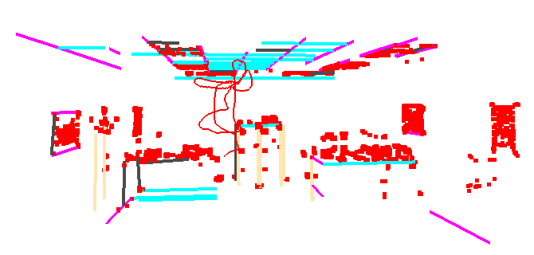                        | 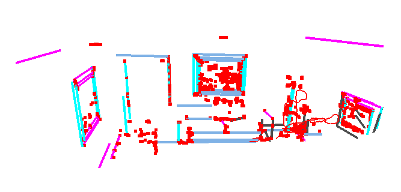                    |
| *office1:*  [img]()  [observation]()  [initial factor graph]() | *livingroom1:*  [img]()  [observation]()  [initial factor graph]() |
| 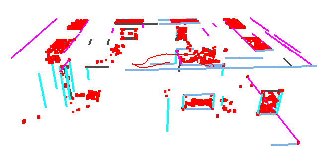                        | 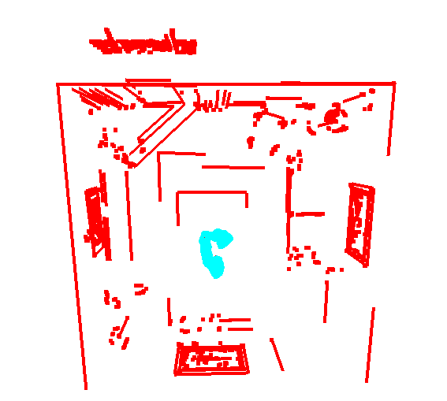                    |
| *office2:*  [img]()  [observation]()  [initial factor graph]() | *livingroom2:*  [img]()  [observation]()  [initial factor graph]() |
| 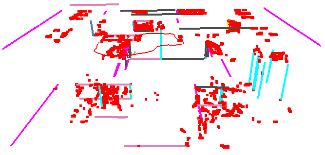                        | 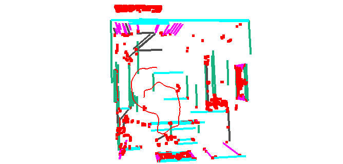                    |
| *office3:*  [img]()  [observation]()  [initial factor graph]() | *livingroom3:*  [img]()  [observation]()  [initial factor graph]() |
| 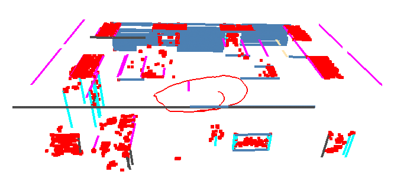                        | 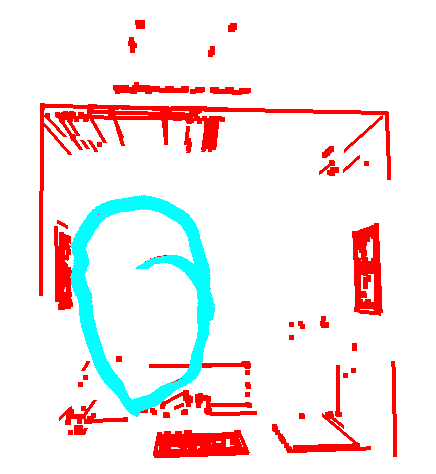                    |


| *nostr_textrue_*far:  [img]()  [observation]()  [initial factor graph]() | *box1:*  [img]()  [observation]()  [initial factor graph]()  |
| ------------------------------------------------------------ | ------------------------------------------------------------ |
| 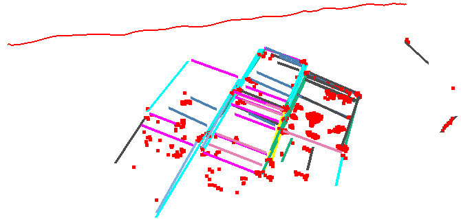 | 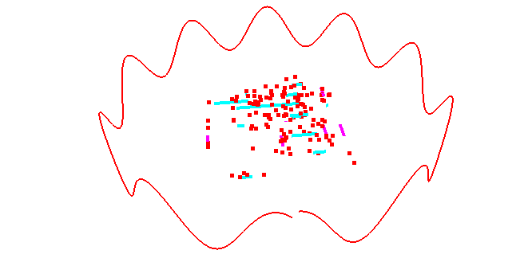                      |
| *nostr_texture_near_loop:*  [img]()  [observation]()  [initial factor graph]() | *box2*:  [img]()  [observation]()  [initial factor graph]()  |
| 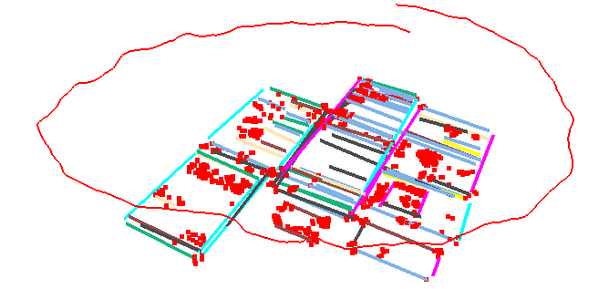 | 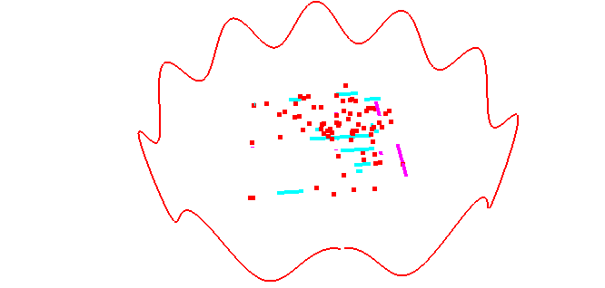                      |
| *str_notexture_far*:  [img]()  [observation]()  [initial factor graph]() | *corridor1*:  [img]()  [observation]()  [initial factor graph]() |
| 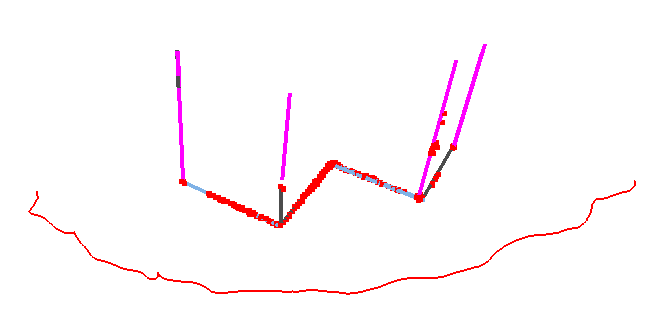 | 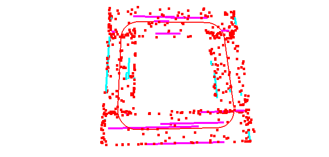            |
| *str_notexture_near*:  [img]()  [observation]()  [initial factor graph]() | *corridor2*:  [img]()  [observation]()  [initial factor graph]() |
| 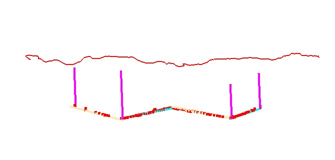 | 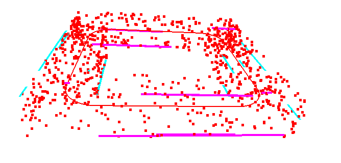            |
| *str_texture_near*:  [img]()  [observation]()  [initial factor graph]() | *sphere1*:  [img]()  [observation]()  [initial factor graph]() |
| 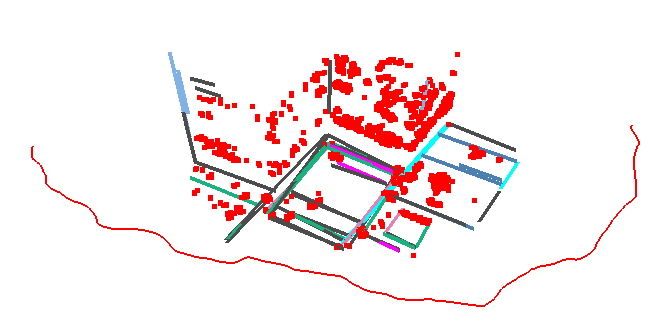 | 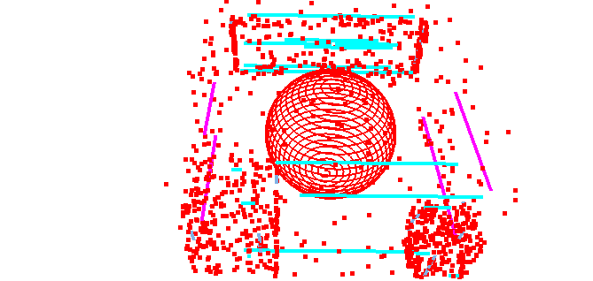                |
| *str_texture_far*:  [img]()  [observation]()  [initial factor graph]() | *sphere2*:  [img]()  [observation]()  [initial factor graph]() |
| 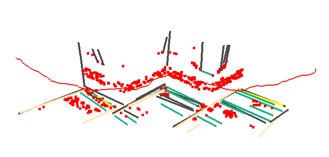 | 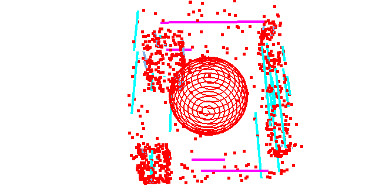                |


| *hospital*: [img]()  [observation]()  [initial factor graph]() | *japanesealley*: [img]()  [observation]()  [initial factor graph]() |
| ------------------------------------------------------------ | ------------------------------------------------------------ |
| 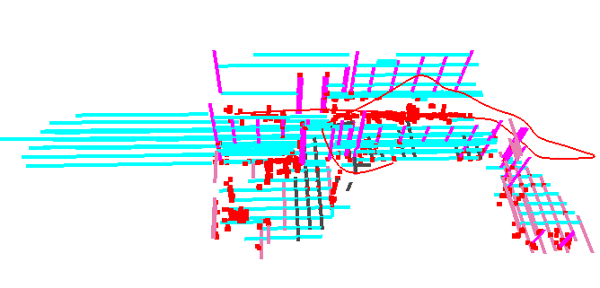              | 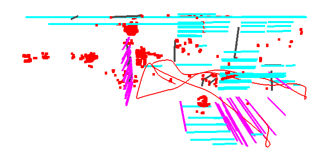    |
| *carwelding*: [img]()  [observation]()  [initial factor graph]() | *office*: [img]()  [observation]()  [initial factor graph]() |
| 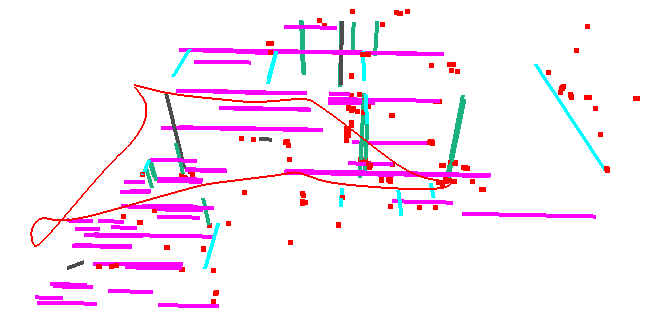          | 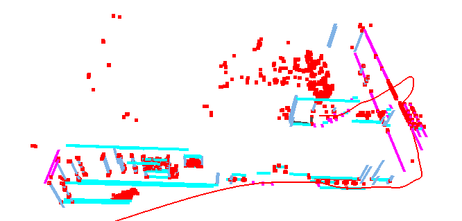                  |


### 2. Data file introduction

**2.1** Camera pose

```
#time_stamp tx ty tz w qx qy qz
1403715524952142848 0.515106 1.996191 0.970863 0.161995 0.789933 -0.205509 0.554554
1403715525002142976 0.514936 1.995769 0.970636 0.161858 0.789935 -0.205406 0.554629
1403715525052143104 0.514841 1.995542 0.970493 0.161559 0.790005 -0.205211 0.554688
1403715525102142976 0.514663 1.995254 0.970343 0.161424 0.790001 -0.205395 0.554666
1403715525152143104 0.514511 1.995028 0.970267 0.161506 0.789974 -0.205451 0.554659
1403715525202142976 0.514420 1.994890 0.970215 0.161471 0.789928 -0.205711 0.554639
1403715525252142848 0.514358 1.994813 0.970228 0.161750 0.789850 -0.206026 0.554551
...
```

**2.2**  point and line landmarks

```
#mp_id x y z
0 -2.91190004 -3.40980005 0.45410001
1 -2.93079996 -3.42319989 0.77450001
2 -2.85829997 -3.43190002 1.08029997
3 -3.30690002 -3.43400002 1.33879995
4 -3.63730001 -3.41860008 1.96889997
5 -3.30819988 -3.43540001 1.64699996
6 -3.30629992 -3.43519998 1.95360005
7 -2.98830009 -3.43470001 1.37
```

```
# ml_id startpoint_x startpoint_y startpoint_z endpoint_x endpoint_y endpoint_z  
0 -4.308  4.835  3.48  -4.376 -3.322  3.549
1 -4.32934315  1.37896258  2.04922319 -4.34565685 -0.57796258  2.06577681
2 -4.32835951  1.36699969  1.0787398  -4.34464049 -0.58599969  1.0952602 
3 -4.36316546 -1.4910902   2.47208701 -4.37383454 -2.7709098   2.48291299
4 -4.33162747 -1.52501158  2.34405582 -4.34137253 -2.69398842  2.35394418
5 -4.31428179 -1.62100063  2.25571976 -4.32271821 -2.63299937  2.26428024
6 -3.249979   -2.9750467   1.92745663 -3.253021   -3.3399533   1.93054337
7 -4.31731495 -1.60897868  0.09025341 -4.32568505 -2.61302132  0.09874659
```

**2.3** initial factor graph 

2D measurements, association and structural_relationship are saved in the *venom_sequence.txt*. 

```
# camera pose camera_id tx ty tz w qx qy qz
Vertex: 0 9 0 1.5 0.612372 0.612372 -0.353553 -0.353553
Vertex: 1 8.98098 0.589154 1.22809 0.592102 0.631787 -0.365196 -0.341896
Vertex: 2 8.93919 1.15616 0.468658 0.571657 0.649907 -0.376265 -0.330535
Vertex: 3 8.85906 1.78881 -0.458078 0.548322 0.669713 -0.388046 -0.316619
Vertex: 4 8.85906 1.78881 -0.458078 0.548322 0.669713 -0.388046 -0.316619
Vertex: 5 8.85906 1.78881 -0.458078 0.548322 0.669713 -0.388046 -0.316619
Vertex: 6 8.85906 1.78881 -0.458078 0.548322 0.669713 -0.388046 -0.316619
Vertex: 7 8.22707 3.83485 0.303868 0.475772 0.74048 -0.400928 -0.254141
```

```
# mappoint mappoint_id x y z
Mappoint: 0 -3.80618 -1.53776 -1.57993
Mappoint: 1 0.0841423 2.3889 -1.66571
Mappoint: 2 2.91888 -3.25578 -1.40552
Mappoint: 3 1.60385 -4.63493 -1.19756
Mappoint: 4 0.185122 3.86562 -1.32754
```

```
# mapline mapline_id startpt_x startpt_y startpt_z endpt_x endpt_y endpt_z
Mapline: 0 -3.37754 0.663405 -1.52195 -2.75461 3.31857 -1.46272
Mapline: 1 2.62544 -2.49739 -1.57528 3.26392 0.204627 -1.52175
Mapline: 2 4.21739 2.26611 -1.03477 2.80642 -3.67416 -1.11441
Mapline: 3 -1.94035 -3.8618 -1.53726 0.220529 -4.35822 -1.43393
Mapline: 4 -0.833943 4.13983 -1.60495 2.29979 3.34867 -1.48157
Mapline: 5 2.51989 -0.386 -1.06529 2.74361 0.770329 -1.06745
Mapline: 6 0.79177 0.5455 -0.249032 0.83383 0.580336 -0.234998
```

```
# association_mappoint mappoint_id frame_id pixel_u pixel_v  
MappointFrameAsso: 0 93 148.754 37.8171 
MappointFrameAsso: 0 97 189.019 32.1689 
MappointFrameAsso: 0 98 204.867 77.1086 
MappointFrameAsso: 0 99 220.044 107.356 
MappointFrameAsso: 1 0 449.56 178.401 
MappointFrameAsso: 1 1 456.985 166.945 
MappointFrameAsso: 1 2 464.908 131.466 
MappointFrameAsso: 1 3 476.021 79.0406 
MappointFrameAsso: 1 4 484.594 32.7214 
MappointFrameAsso: 1 5 491.087 14.4848 
MappointFrameAsso: 1 6 488.677 38.3484 
```

```
# association_mapline mapline_id frame_id pixel_u pixel_v pixel_d pixel_u pixel_v pixel_d 
MaplineFrameAsso: 0 93 254.405 27.5671 11.3128 367.789 20.6281 12.417 
MaplineFrameAsso: 0 97 294.958 27.242 11.5834 415.122 20.6791 12.0444 
MaplineFrameAsso: 0 98 304.754 70.204 12.1618 423.135 65.1801 12.4164 
MaplineFrameAsso: 0 99 317.297 104.368 12.5709 431.924 102.756 12.6028 
MaplineFrameAsso: 1 0 197.67 285.283 7.12707 404.852 284.312 7.09549 
MaplineFrameAsso: 1 1 182.798 262.762 7.11463 390.806 269.337 6.95629 
MaplineFrameAsso: 1 2 163.162 206.213 6.82113 379.979 218.205 6.59725 
MaplineFrameAsso: 1 3 137.986 131.541 6.46938 365.636 145.696 6.07546 
MaplineFrameAsso: 1 4 119.341 63.8916 6.31764 352.233 79.3842 5.72008 
```

```
# parallel_lines mapline_id mapline_id mapline_id mapline_id mapline_id
ParalineMaplineAsso: 0 10 3 4 9 10 15 16 21 22 27 28 
```

