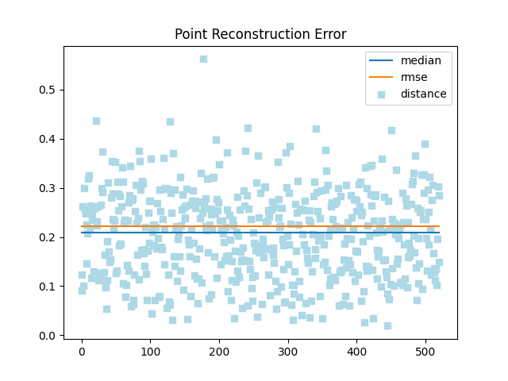
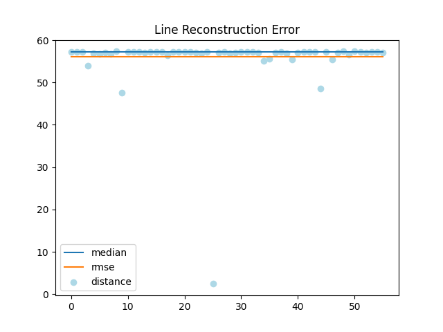

### Reconstruction Error Tool

```
python3  sparse_reconstruction_error.py --esti_map ../paper_Sphere/Point_Mappoint.txt --gt_map ../paper_Sphere/venom_sequence.txt --landmark_type point --plot norm

python3  sparse_reconstruction_error.py --esti_map ../paper_Sphere/PointLine_mapline.txt --gt_map ../paper_Sphere/venom_sequence.txt --landmark_type line --plot norm
```

|                                                              |                                                              |
| ------------------------------------------------------------ | ------------------------------------------------------------ |
|  |  |
